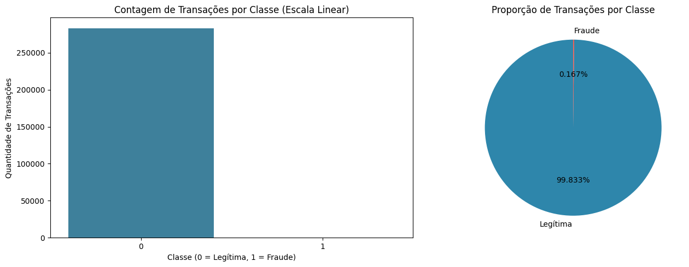
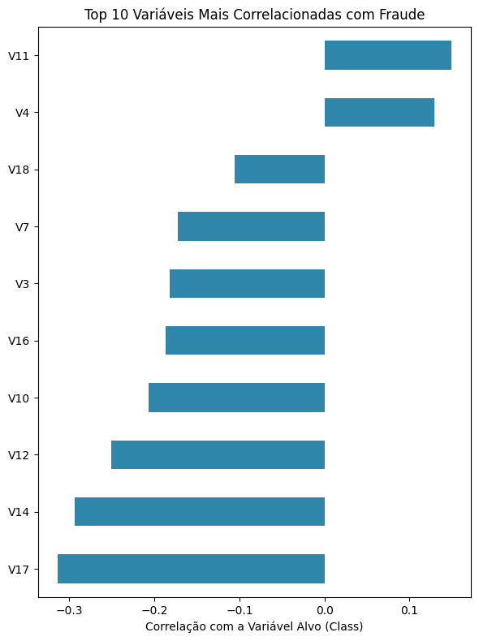
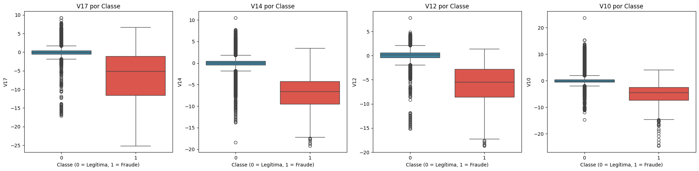
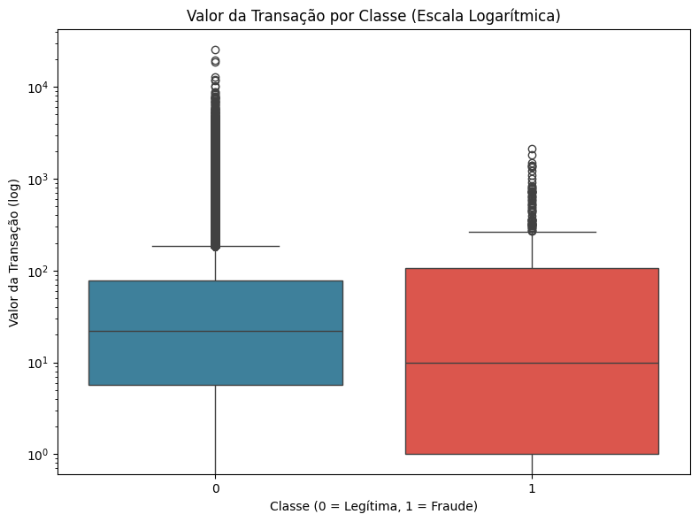
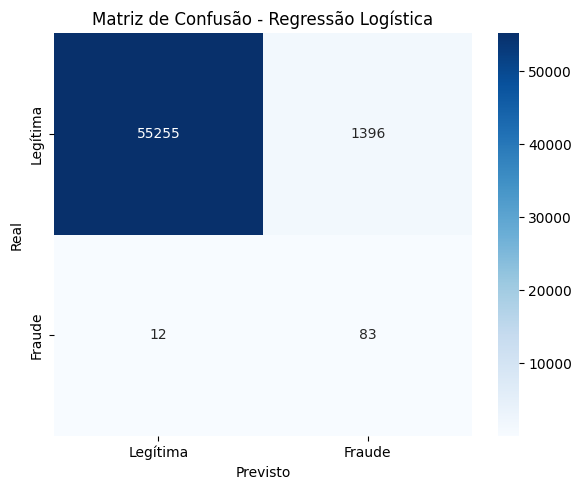
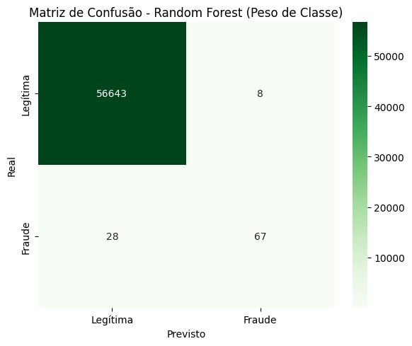
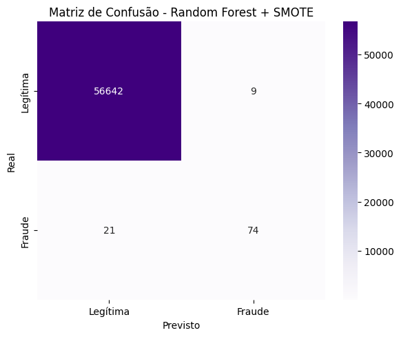
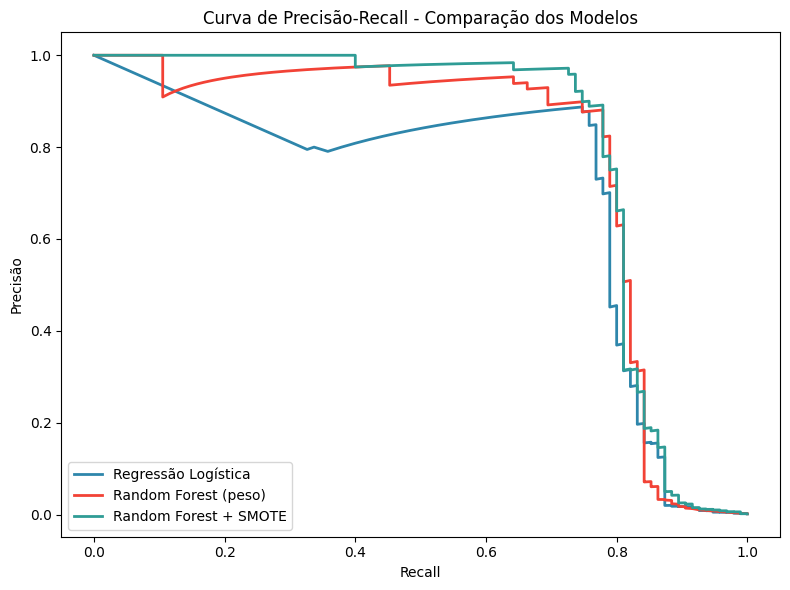
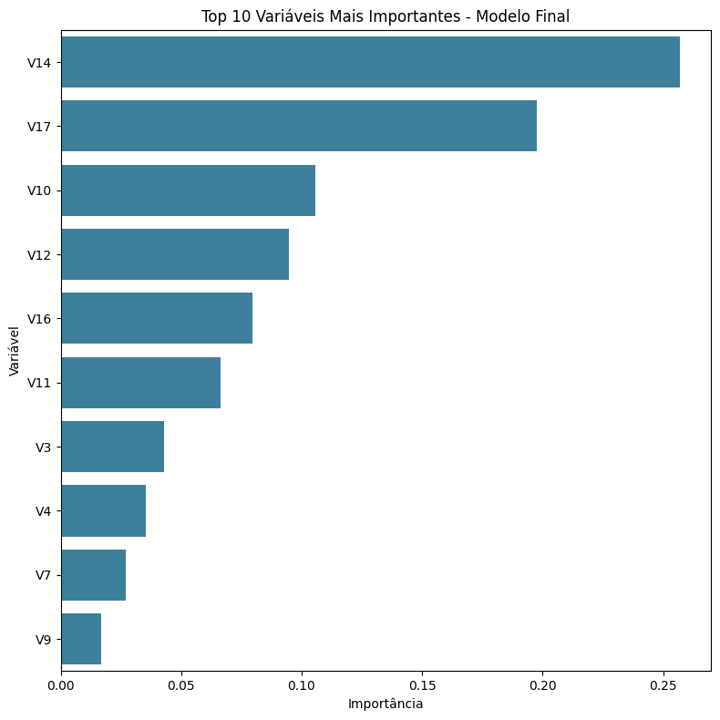

# 💳 Detecção de Fraudes em Transações de Cartão de Crédito

### 📊 Projeto de Ciência de Dados | Machine Learning

Projeto final desenvolvido no curso Cientista de Dados - EBAC, com o objetivo de analisar transações de cartão de crédito e construir modelos de Machine Learning capazes de identificar operações potencialmente fraudulentas.

O principal desafio do projeto está no forte desbalanceamento entre transações legítimas e fraudulentas, tornando necessário utilizar estratégias específicas de tratamento e métricas adequadas para avaliar os modelos.

---

## 🎯 1. Objetivo do projeto

O objetivo deste projeto é desenvolver um modelo de classificação capaz de identificar transações fraudulentas em uma base de operações com cartão de crédito.

A análise busca responder:

> Como utilizar técnicas de Ciência de Dados e Machine Learning para identificar transações fraudulentas, considerando o forte desbalanceamento existente entre as classes?

Além da construção dos modelos, o projeto também busca compreender os padrões presentes nos dados e avaliar quais estratégias apresentam melhor desempenho na identificação de fraudes.

---

## 🗂️ 2. Dados utilizados

A base utilizada contém informações sobre transações realizadas com cartão de crédito.

A variável `Class` representa o resultado da transação:

- `0` → Transação legítima
- `1` → Transação fraudulenta

Após a análise inicial e a remoção de registros duplicados, a base passou a contar com **283.726 registros**.

### 📌 Distribuição das classes

- 💚 Transações legítimas: **283.253**
- 🚨 Transações fraudulentas: **473**
- ⚖️ Fraudes representam aproximadamente **0,17%** da base

Esse forte desbalanceamento é um dos principais desafios do projeto.



---

## 🔎 3. Exploração e preparação dos dados

Inicialmente foram realizadas análises para verificar:

- Dimensão da base
- Tipos das variáveis
- Valores ausentes
- Estatísticas descritivas
- Registros duplicados
- Distribuição das classes

Foram identificadas **1.081 linhas duplicadas**, que foram removidas antes da etapa de modelagem.

Também foi analisada a escala das variáveis. As colunas `Time` e `Amount` apresentam escalas diferentes das variáveis transformadas por PCA, sendo necessária a padronização antes da modelagem.

---

## ⚠️ 4. Análise do desbalanceamento

O desbalanceamento representa um dos principais desafios do problema.

Em uma situação como essa, um modelo poderia apresentar uma acurácia muito elevada simplesmente classificando praticamente todas as transações como legítimas.

Por isso, a acurácia isoladamente não é suficiente para avaliar a qualidade do modelo.

Foram utilizadas principalmente:

- 🎯 Recall
- 🔍 Precisão
- ⚖️ F1-score
- 📈 ROC-AUC
- 📊 PR-AUC
- 🧮 Matriz de confusão

---

## 📈 5. Análise exploratória

A análise exploratória buscou identificar padrões estatísticos relacionados à ocorrência de fraudes.

Foram analisadas as correlações das variáveis com a variável `Class`, a distribuição das principais variáveis e o comportamento dos valores das transações.

### 🔗 Correlação com fraude

Foram analisadas as variáveis que apresentaram maior correlação com a ocorrência de fraude.



### 📦 Distribuição das principais variáveis

As quatro variáveis com maior correlação foram comparadas entre transações legítimas e fraudulentas.



### 💰 Valor das transações

Também foi analisado o comportamento da variável `Amount`.

Como os valores apresentam uma distribuição com cauda longa, foi utilizada uma escala logarítmica para facilitar a visualização.



---

## ⚙️ 6. Pré-processamento

Para preparar os dados para os modelos, foram realizadas as seguintes etapas:

1. 🧹 Remoção das duplicatas
2. 🎯 Separação das variáveis preditoras e da variável alvo
3. ✂️ Divisão dos dados em treino e teste
4. 📏 Padronização utilizando `StandardScaler`
5. ⚖️ Aplicação de estratégias para lidar com o desbalanceamento

A divisão entre treino e teste foi realizada utilizando estratificação para preservar a proporção das classes.

---

## 🤖 7. Modelagem

Foram desenvolvidas três abordagens diferentes para comparar estratégias de classificação.

### 📌 7.1 Regressão Logística

A Regressão Logística foi utilizada como modelo baseline.

O modelo apresentou um bom Recall, porém com baixa Precisão, indicando uma maior quantidade de falsos positivos.



### 🌳 7.2 Random Forest com peso de classe

O segundo modelo utilizou Random Forest com `class_weight`, buscando aumentar a atenção do algoritmo para a classe minoritária.

O modelo apresentou um equilíbrio significativamente melhor entre Recall e Precisão.



### ♻️ 7.3 Random Forest + SMOTE

Por fim, foi utilizado o algoritmo SMOTE para realizar o balanceamento da classe minoritária no conjunto de treinamento.

O SMOTE foi aplicado somente aos dados de treinamento, evitando vazamento de informações do conjunto de teste.



---

## 📊 8. Comparação dos modelos

Os modelos foram avaliados utilizando métricas mais adequadas para problemas de classificação desbalanceada.

| Modelo | Recall | Precisão | F1-score | ROC-AUC | PR-AUC |
|---|---:|---:|---:|---:|---:|
| Regressão Logística | 0,874 | 0,056 | 0,105 | 0,966 | 0,672 |
| Random Forest + Peso de Classe | 0,705 | 0,893 | 0,788 | 0,952 | 0,780 |
| Random Forest + SMOTE | **0,779** | **0,892** | **0,831** | **0,976** | **0,807** |

### 🎯 Precision-Recall

A curva Precision-Recall permite analisar melhor o comportamento dos modelos diante do forte desbalanceamento da base.



---

## 🏆 9. Seleção do modelo final

O modelo selecionado foi o:

### 🌳 Random Forest + SMOTE

A escolha ocorreu principalmente pelo equilíbrio apresentado entre as métricas.

O modelo alcançou:

- 🎯 Recall: **0,779**
- 🔍 Precisão: **0,892**
- ⚖️ F1-score: **0,831**
- 📈 ROC-AUC: **0,976**
- 📊 PR-AUC: **0,807**

O uso do SMOTE contribuiu para melhorar o F1-score e o PR-AUC em relação às demais abordagens.

---

## 🔬 10. Importância das variáveis

Após a seleção do modelo final, foi analisada a importância das variáveis utilizadas pelo Random Forest.

Essa etapa permite identificar quais características tiveram maior contribuição para as decisões realizadas pelo modelo.



É importante destacar que as variáveis `V1` a `V28` foram transformadas por PCA e, portanto, não possuem uma interpretação direta como variáveis originais.

---

## 💡 11. Resultados e principais aprendizados

O projeto permitiu observar que:

- ⚠️ O forte desbalanceamento é o principal desafio da base.
- 📊 A acurácia, apesar de elevada, não é suficiente para avaliar um modelo de detecção de fraude.
- 🎯 A Regressão Logística apresentou bom Recall, mas baixa Precisão.
- 🌳 O Random Forest apresentou um equilíbrio significativamente melhor entre as métricas.
- ♻️ O SMOTE contribuiu para melhorar o F1-score e o PR-AUC.
- 🏆 O Random Forest com SMOTE foi selecionado como modelo final.
- 🔎 A análise exploratória e a importância das variáveis apresentaram resultados consistentes.

---

## ⚠️ 12. Limitações

Apesar dos resultados obtidos, o projeto apresenta algumas limitações:

- As variáveis `V1` a `V28` são transformadas por PCA e não possuem interpretação direta.
- O dataset apresenta forte desbalanceamento.
- O SMOTE foi aplicado somente ao conjunto de treinamento para evitar vazamento de dados.
- Os resultados representam o comportamento dos modelos nesse conjunto de dados e não garantem o mesmo desempenho em operações futuras.
- Em um ambiente real, seria necessário considerar os custos financeiros associados aos falsos positivos e falsos negativos.
- Também seria importante acompanhar mudanças nos padrões de fraude ao longo do tempo.

---

## 🛠️ 13. Tecnologias utilizadas

- 🐍 Python
- 🐼 Pandas
- 🔢 NumPy
- 📊 Matplotlib
- 📈 Seaborn
- 🤖 Scikit-learn
- ⚖️ Imbalanced-learn
- 📓 Jupyter Notebook

---

## 📂 14. Estrutura do projeto

```text
projeto-deteccao-fraude-cartao/
│
├── README.md
│
├── data/
│   ├── Base_M43_Pratique_CREDIT_CARD_FRAUD.csv
│   └── projeto_deteccao_fraude_cartao_credito.ipynb
│
└── images/
    ├── distribuicao_classes.png
    ├── correlacao_fraude.png
    ├── distribuicao_variaveis.png
    ├── valor_transacoes.png
    ├── matriz_confusao_logistica.png
    ├── matriz_confusao_random_forest.png
    ├── matriz_confusao_random_forest_smote.png
    ├── curva_precision_recall.png
    └── feature_importance.png
